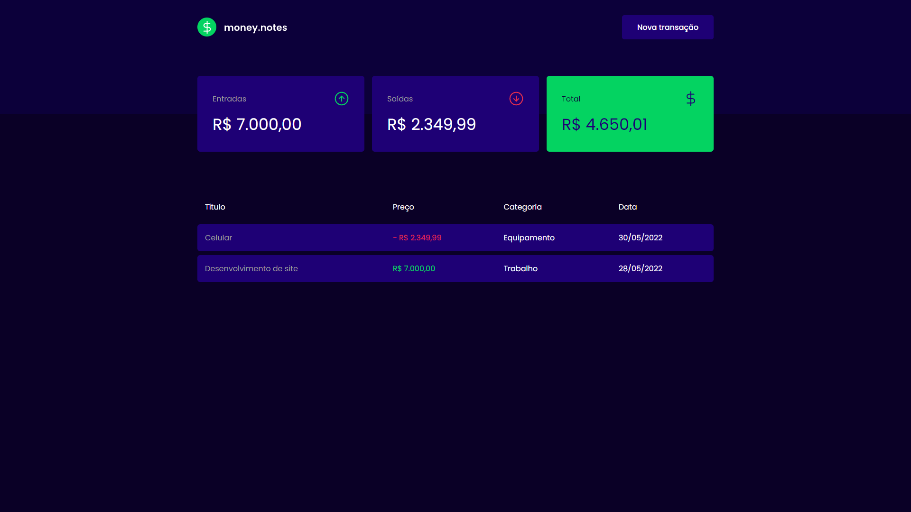
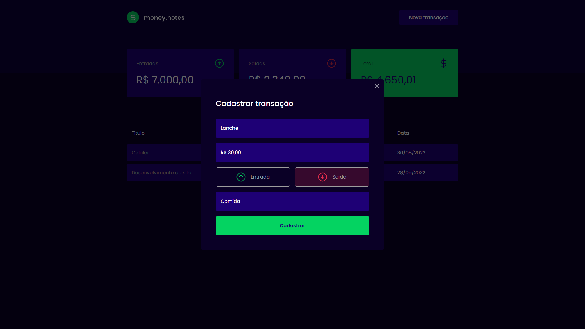
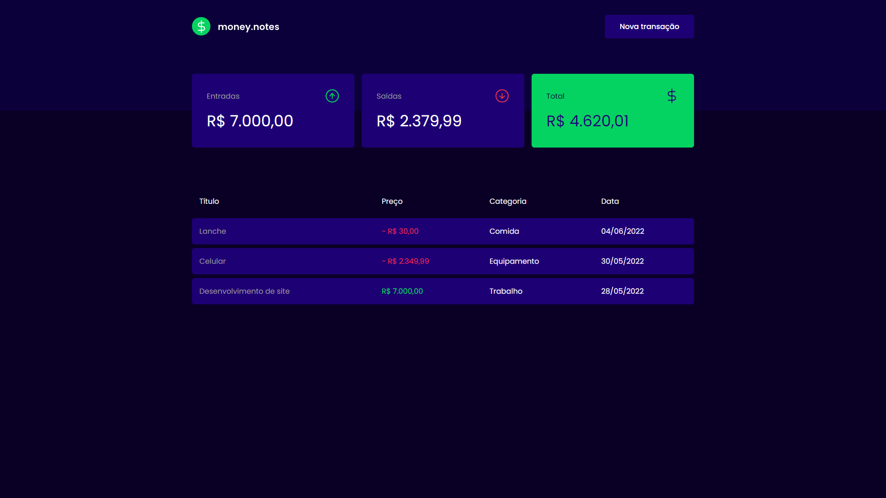

# money.notes

Um gerenciador financeiro para você anotar todos os seus ganhos e gastos para se manter em seu planejamento e fechar todos os meses no verde.

## Vantagens

- Monitore todos os seus gastos e ganhos

- Registre seus ganhos ou gastos

- Saiba se você está gastando muito ou se está economizando e lucrando

> **Obs.:** Essa aplicação foi feita para fins de aprendizado. É uma cópia da aplicação _dtmoney_ do curso _Ignite_ da plataforma _Rocketseat_ na tentativa de aplicar o _modo escuro_ ao invés do layout claro original.
